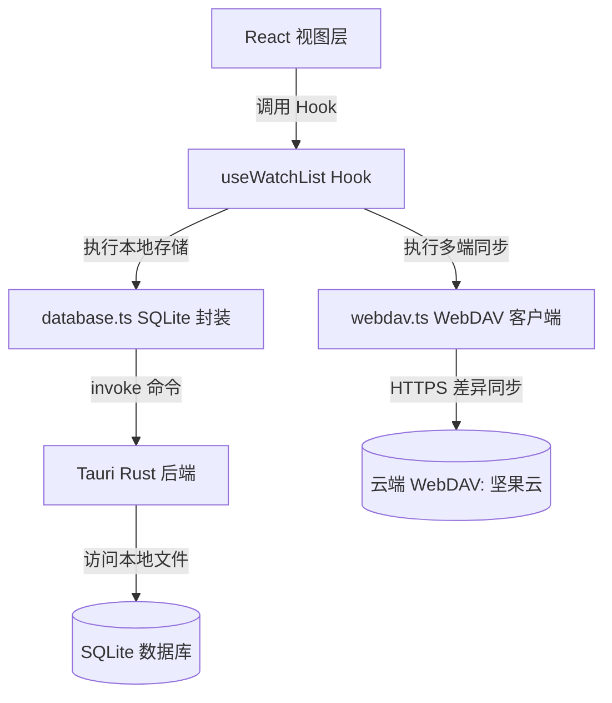

# WatchTracker 项目架构与目录结构说明文档

本项目是基于 **React 19 + TypeScript + Vite + TailwindCSS** 构建的前端，并结合 **Tauri v2 (Rust)** 驱动的跨平台桌面应用。用于帮助用户追踪、记录和分析影视观看历史，支持多设备 WebDAV 同步。

为了维护代码的高可扩展性和可读性，项目采用了**基于领域特征的模块化（Feature-based）**目录结构设计。

---

## 📁 整体目录树

```text
D:\Project\Projects\WatchTracker-GitHub-Source\
├── src-tauri/                    # Tauri Rust 后端目录
│   ├── Cargo.toml                # Rust 依赖与项目配置文件
│   ├── tauri.conf.json           # Tauri 应用配置文件
│   ├── src/                      # Rust 源代码 (平台交互、本地存储等)
│   └── gen/                      # 生成的各种移动端/桌面端构建环境
├── src/                          # 前端 React 源代码
│   ├── app/                      # 应用全局配置与页面主入口
│   │   ├── App.css
│   │   └── App.tsx               # 主容器组件 (控制逻辑与数据分流)
│   ├── assets/                   # 静态图片及矢量图标资源
│   ├── features/                 # 功能领域划分的业务模块
│   │   ├── categories/           # 分类管理业务 (状态、Hook等)
│   │   ├── dashboard/            # 数据看板业务 (分析、图表等)
│   │   ├── settings/             # 设置业务 (数据备份、WebDAV配置等)
│   │   └── watchlist/            # 影视记录追踪核心业务 (列表、海报墙、添加表单等)
│   ├── shared/                   # 全局共享模块 (与特定业务解耦)
│   │   ├── components/           # 通用 UI / 功能型组件 (如 ErrorBoundary)
│   │   ├── lib/                  # 工具库封装 (数据库客户端、WebDAV同步、数据分析等)
│   │   └── types/                # 跨业务共享的全局 TypeScript 类型定义
│   ├── index.css                 # 全局 TailwindCSS 注入与基本样式
│   └── main.tsx                  # 前端挂载入口
├── index.html                    # HTML 主模板
├── package.json                  # 前端 Node.js 依赖配置
├── tsconfig.json                 # TypeScript 编译选项
└── vite.config.ts                # Vite 构建配置文件
```

---

## 🧩 核心模块职责说明

### 1. `src/app/` (应用入口与布局)
*   **`App.tsx`**：主入口程序。仅负责应用级状态的管理（如筛选器状态、加载中状态、弹窗显隐）、基础事件分配以及整体布局的协调。
*   **重构说明**：已完成拆分，原本的顶部导航栏、卡片列表拖拽、海报墙等大块逻辑已被解耦至 `features/watchlist/components/`，使得 `App.tsx` 逻辑大幅精简，维护成本显著降低。

### 2. `src/features/` (业务功能驱动目录)
每个文件夹代表一个独立的业务模块，内部采用统一的结构组织其专属的 `components/`（组件）和 `hooks/`（状态钩子）。
*   **`watchlist/`**：核心影视记录模块。
    *   `components/Header.tsx`：控制中心顶部栏，提供搜索、多重排序、锁定筛选、视图切换以及 WebDAV 同步开关。
    *   `components/ListView.tsx`：基于 `@dnd-kit` 的网格列表视图，支持卡片在自定义排序模式下的拖拽重排。
    *   `components/PosterWall.tsx`：高保真海报墙视图，带智能备用图片加载机制及进度追踪微调。
    *   `components/RecordCard.tsx` / `RecordForm.tsx`：记录展示卡片与影视信息添加/修改对话框。
    *   `hooks/useWatchList.ts`：处理影视数据的核心 CRUD 及定时自动同步底层 Hook。
*   **`categories/`**：分类/标签模块。
    *   `hooks/useCategories.ts`：处理自定义分组、图标 Emoji 映射及数据加载。
*   **`dashboard/`**：多维度数据可视化看板。
    *   `components/Dashboard.tsx`：影视消费时长、年度观影变化、分类占比的可视化展示。
*   **`settings/`**：备份配置模块。
    *   `components/SettingsModal.tsx`：包含 WebDAV 坚果云配置、备份导入导出、自动同步间隔设置。

### 3. `src/shared/` (高内聚、零业务依赖的共享代码)
*   **`lib/database.ts`**：数据库抽象层。封装与 Tauri Rust 后端底层的 SQLite 进行数据存储和检索交互。
*   **`lib/webdav.ts`**：WebDAV 通信层。处理与云端存储（如坚果云）的加密数据备份、差异对比与覆盖合并。
*   **`lib/analytics.ts`**：纯函数算法。用于计算观影待看价值 (Watch Value) 等统计分析。
*   **`types/index.ts`**：影视项目核心模型定义（如 `WatchRecord`, `Category`, `Status`）。

---

## 🔄 前后端数据通信架构



---

## 🛠️ 后续开发指南

1.  **添加新功能**：如果需要增加如“影评功能”，应当在 `src/features/` 下新建 `reviews/` 子目录，并在该目录下组织其专有的子组件及 Hook，而不是散落在 `shared/` 里。
2.  **通用 UI 开发**：不含业务状态的纯 UI 交互组件（如通用 Button、Dropdown、Modal）应当存放在 `src/shared/components/`，便于跨模块无阻碍复用。
3.  **构建缓存清理**：如果发现项目占用空间异常庞大，可进入 `src-tauri` 目录运行 `cargo clean` 或在根目录执行 `npm run tauri clean` 来清理几吉字节的 Rust 临时编译缓存。
