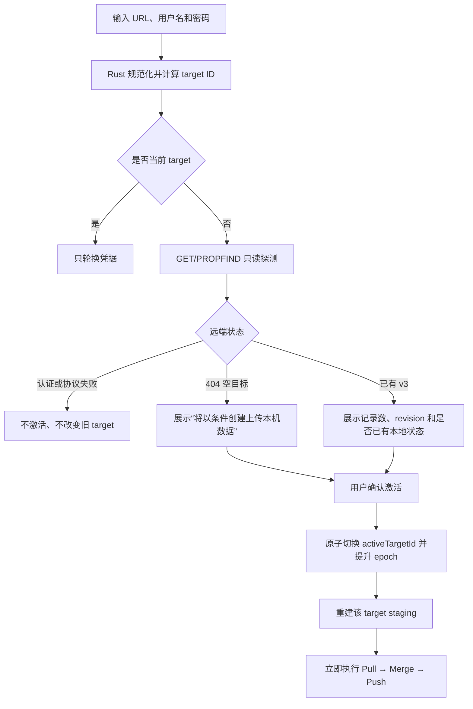

# TASK-D-SYNC-003：WebDAV 目标隔离与安全切换专项设计

> 状态：IMPLEMENTED，已于 2026-08-02 按确认方案实施
> 日期：2026-08-02  
> 数据库：继续使用 V18；通过 `settings` 命名空间隔离  
> 依赖：`TASK-D-SYNC-001/002/001-R2` 已实现的条件提交、主动拉取、暂存与发布恢复

## 1. 目标与边界

当前 WebDAV URL、账号和所有同步状态均使用全局 setting。直接更换 URL 或用户名后，旧 target 的 baseline、ETag、冲突或发布意图可能被错误用于新云端。本任务要保证：

1. 每个 URL＋用户名组合拥有独立同步状态和凭据槽。
2. 切换前只读探测新云端，激活后第一轮仍严格 Pull → Merge → Push。
3. 切换期间的旧网络请求不能提交到新 target 的本地状态。
4. 旧 target 的 pending、冲突和不确定发布完整保留，切回后可继续恢复。
5. 现有全局状态原子迁移且数据库继续保持 V18。

第一版把多个 target 视为“同一本地影视库的不同同步端点”。records、Tombstone、records generation 和 device ID 仍为全局业务状态；本任务不实现每个账号一套独立本地片库。Windows 原生凭据保护继续由 `TASK-D-SEC-001` 负责。

## 2. Target ID

Rust 统一规范化连接身份：

- URL 必须是 HTTP(S)，移除 query、fragment 和 userinfo；scheme/host 小写，移除默认端口，路径保留大小写并确保末尾只有一个 `/`。
- 用户名只移除首尾空白，保留大小写；不把可能区分大小写的账号强制转换。
- 密码、代理和同步频率不参与 target ID。
- `targetId = SHA-256("watchtracker-target-v1\n" + normalizedUrl + "\n" + username)`，保存完整 64 位十六进制值。

因此修改密码属于同一 target 的凭据轮换；修改 URL 或用户名才创建或切换 target。

## 3. 状态模型

新增全局注册表 `sync_targets_v1`：

```json
{
  "version": 1,
  "activeTargetId": "<sha256|null>",
  "targetEpoch": 3,
  "targets": [{
    "id": "<sha256>",
    "normalizedUrl": "https://example/dav/影视追踪/",
    "username": "user@example.com",
    "createdAt": "...",
    "lastActivatedAt": "..."
  }]
}
```

注册表不保存密码。每个 target 使用独立 settings 行，避免每次 CRUD 都重写包含 1,000 余条 baseline 的大 JSON：

```text
sync_target::<id>::credentials
sync_target::<id>::baseline_v3
sync_target::<id>::remote_etag
sync_target::<id>::conflicts_v3
sync_target::<id>::last_commit_v3
sync_target::<id>::v2_source_fingerprint
sync_target::<id>::outbox_v1
sync_target::<id>::scheduler_v1
sync_target::<id>::staging_v1
sync_target::<id>::publish_intent_v1
```

credentials 继续保存当前加密字符串，不保存明文。以下状态保持全局：records、`sync_tombstones`、`records_generation`、`sync_device_id_v1`、代理、编辑防抖和主动拉取周期。

## 4. 目标感知的原子边界

`get_sync_snapshot` 增加 `targetId` 与 `targetEpoch`。下列命令必须携带并校验两者：

- 准备发布意图；
- 提交同步结果；
- 记录 target 调度成功/失败；
- 解决 target 冲突。

激活、断开或切换 target 都在单事务内提升 `targetEpoch`。若网络等待期间发生切换，旧请求仍只指向它启动时取得的旧 URL；它的本地 commit 因 epoch 不匹配而失败，旧 target 的发布意图继续留在旧命名空间，切回后按 commitId＋payload 指纹恢复。

本地 CRUD 只更新当前 active target 的 outbox 和 staging。重新激活任意 target 时，Rust 必须按当前 records/Tombstone 与该 target baseline 重建差异，因此该 target 在未激活期间发生的本地变化不会遗漏。

## 5. 安全切换流程



规则：

- 当前 target 存在 staged、publish intent、outbox 或冲突时允许切走，但界面必须说明它们会被冻结并在切回后继续，绝不清除。
- 新 target 已有远端数据且没有共同 baseline 时，唯一 ID 自动并集；同 ID 业务字段不同进入整条记录冲突，不能默认本机或云端覆盖。
- 新 target 为 404 时只能用 `If-None-Match: *` 创建。
- 已注册 target 切回时恢复它自己的 baseline、ETag、冲突、调度和发布意图。
- “清除凭据”只断开并保留 target 状态。第一版不提供永久删除 target 状态，避免误删未发布版本。

## 6. 旧全局状态迁移

首次升级且没有 `sync_targets_v1` 时：

1. 应用退出旧同步协调器并创建 `target-migration` 自动恢复点。
2. Rust 在内存中解密现有 `webdav_creds`，结合 `webdav_url` 计算 target ID；明文不写日志或数据库。
3. 在一个 SQLite 事务中写入注册表、target credentials 和全部 target-scoped 状态。
4. 回读并解析新状态；全部通过后在同一事务删除旧全局键并提交。
5. 任一步失败整体回滚，旧键保持不变，自动同步以 `target_migration_required` 阻断。

若旧凭据无法解密，不猜测账号、不创建 target；设置页要求重新输入 URL、用户名和密码，成功后再执行同一迁移。迁移不改 records、Tombstone、generation、V18 标记或云端文件。

## 7. 设置页交互

第一版显示：

- 当前 target：URL、用户名、最近成功、pending/冲突数量；
- 已保存 target 列表及“切换”操作；
- 保存相同 target 时显示“更新凭据”，保存不同 target 时先进入只读探测和确认；
- pending target 切走警告、无 baseline 首次合并警告和迁移失败说明；
- 断开连接不删除状态的明确文案。

任何通知和日志只使用 target ID 短指纹；不得记录密码、解密字符串或 Authorization。

## 8. 实施顺序

1. Rust 增加 URL 规范化、target ID、注册表和命名空间访问器。
2. 将 snapshot、outbox、scheduler、staging、publish intent、baseline 和冲突改为 target-aware。
3. 增加 target epoch CAS 与旧状态原子迁移。
4. 前端协调器接入目标快照、只读探测、切换和切回恢复。
5. 设置页增加当前目标和保存目标列表；保持现有手动同步入口。
6. 完成临时数据库、Node 纯函数和 Playwright mock 验收后，再按便携版安全流程部署。

## 9. 验收矩阵

### Rust / 临时 SQLite

- URL 规范化、默认端口、路径大小写、用户名大小写和密码轮换的 target ID。
- 全部 target-scoped key 隔离；A 的 commit 不修改 B。
- 切换提升 epoch；旧 in-flight commit、prepare intent 和失败记录均被拒绝。
- 切回重建离线期间差异；A/B 各自 pending、冲突和发布意图保留。
- 旧全局键完整迁移；注入任意写入/解析失败整体回滚。
- 无凭据、损坏注册表和无法解密凭据安全阻断。

### Node / 纯函数

- canonical URL 与 target ID 确定性。
- 新空目标、已有远端、已注册目标和同 target 密码轮换的切换决策。
- target epoch 变化和首次无 baseline 合并分类。

### Playwright / mock WebDAV

- 相同 URL＋用户名更新密码不创建新 target。
- 切换前只有 GET/PROPFIND，确认前零 PUT、零 active target 写入。
- 空目标条件创建；已有目标同 ID 差异进入冲突。
- A pending 时切 B、再切回 A 后恢复上传。
- 网络中切换导致旧 commit 被拒绝且两个 target 数据均不被错误覆盖。
- 迁移成功提示一次；迁移失败仍可使用本地数据并禁止自动上传。

真实 WebDAV 不用于自动化；真实便携数据库仅在部署前后做只读哈希、V18、记录数和完整性校验。

## 10. 已确认方案

用户已确认按本文方案实施，并锁定以下产品边界：多个 WebDAV target 是同一本地影视库的不同同步端点，不是多套独立本地资料库；第一版只允许断开并保留 target，不提供永久删除 target 状态。

## 11. 实施结果

实现保持数据库 V18，以 `sync_targets_v1` 注册表和 `sync_target::<id>::…` settings 行隔离全部目标级状态。Rust 负责 URL 规范化、SHA-256 target ID、旧全局键恢复点迁移、切回差异重建以及 target ID＋epoch CAS；前端设置页负责只读探测、明确确认、目标列表、断开保留和激活后的首次 Pull → Merge → Push。

自动化门禁通过 Rust 62/62、Node 68/68、Playwright 52/52、TypeScript、ESLint、生产构建与 rustfmt。测试使用临时 SQLite 和 mock WebDAV；真实远端未参与自动化，真实便携数据库留待部署前后只读核验。
